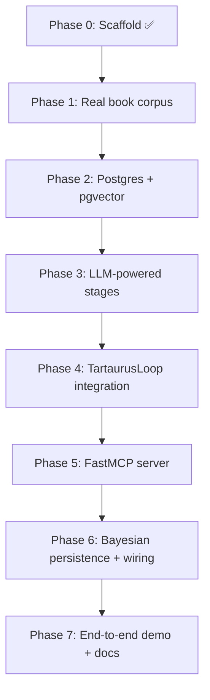

# Tutorial Implementation Plan — Full System Build

> **Purpose.** This document is the phased build plan for the **Python for CCA-F** tutorial's
> running example: a **10-book advertising knowledge assistant** with staged-reduction RAG,
> TartaurusLoop orchestration, MCP exposure, and a six-schema Bayesian score-keeping loop.
>
> The architecture is already designed in `../advertising_systems_tutorial_legacy/`. This plan
> maps that design onto the new CCA-F tutorial (Modules 00–08) and shows what exists today,
> what to build next, and how to verify each phase.

---

## Audience & scope

**This repo is a consulting deliverable — not for public release.**

| | This tutorial (`advertising_system_tutorial/`) | Legacy (`advertising_systems_tutorial_legacy/`) |
|---|--------------------------------------------------|------------------------------------------------|
| **Audience** | Don Ranns and his company (AJA / UndrDog Hemp & Primal Queen) | General audience — intended publishable product |
| **Distribution** | Private handoff only | Self-hosted app + GitHub (planned) |
| **Book corpus** | Full ingest of Don's licensed library is in scope | Copyright-safe excerpts; public-domain where possible |
| **Examples** | Real campaign context OK | Sanitized / synthetic where needed |

Build decisions here optimize for **speed and fidelity for the client**, not open-source
hygiene. The legacy track carries the publishable architecture (graphs, decay, OGrE) when
that product is ready.

---

## North star

One tool — `advertising_knowledge` — that agents call with a question and receive back a
**short, cited briefing**. Behind the tool:

```
Query
  → ROUTE    (library dictionary → pick books + probe plan)
  → PROBE    (hybrid search per book: term hooks + semantic)
  → GAP      (per-book: what's still missing?)
  → SYNTH    (cited briefing)
  → DECIDE   (agent judgment = hypothesis)
  → MEASURE  (campaign metrics = evidence)
  → UPDATE   (α/β score keeping on cited pages)
```

**Teaching constraint:** cohort reads Skilljar code fluently; they write dataclasses, named
venvs, and small tools — not a full platform rewrite.

**Production constraint (from legacy doc 03):** local Postgres + `pgvector`, FastMCP, Anthropic
SDK for orchestration. No Supabase hot path; no GraphQL on retrieval.

---

## Current state (Phase 0 — done)

| Area | Status | Location |
|------|--------|----------|
| Module prose 00–08 | ✅ | `*.md` |
| HTML explainers + offline reader | ✅ | `html/`, `build_reader.py`, `index.html` |
| Named-venv + dataclass pedagogy | ✅ | Modules 00, 02, 05, 08 |
| Mock RAG (4 stages, keyword-only) | ✅ | `code/rag/advertising_knowledge.py` |
| 10 placeholder book names | ✅ | `code/rag/library_dictionary.json` |
| 8 demo passages | ✅ | `code/rag/mock_pages.json` |
| Inner agentic loop (Anthropic) | ✅ | `code/loop/anthropic_agent_loop.py` |
| TartaurusLoop (slim Anthropic) | ✅ dry-run | `code/loop/tartaurus/` |
| Six-schema Bayesian dry demo | ✅ | `code/schemas/bayesian_loop.py` |
| Env loading | ✅ | `code/env_loader.py` |

**Gap:** mock corpus, no real books, no Postgres, no embeddings, no LLM-powered routing/gap,
no MCP server, Bayesian loop not wired to RAG output, retrieval does not re-rank by belief.

---

## Target file tree (end state)

```
advertising_system_tutorial/
  README.md                           # entry point (root)
  md/
    TUTORIAL_IMPLEMENTATION_PLAN.md     ← this file
    MANIFEST.md
    FOUNDATION_*.md, 00_*.md … 08_*.md
  html/                               # visual explainers
  build_reader.py                     # md/ + html/ → index.html
  code/
    env_loader.py
    rag/
      advertising_knowledge.py        # orchestration API (MCP surface)
      library_dictionary.json         # router input — real bibliographic metadata
      books/                          # source PDFs or licensed excerpts (gitignored if large)
      corpus/                         # ingested page JSON or SQL dump
      retrieval/
        postgres.py                   # hybrid search (BM25 + pgvector)
        embed.py                      # embedding batch job
      stages/
        route.py                      # LLM router: term hooks + semantic queries
        probe.py
        gap.py
        synthesize.py
    loop/
      anthropic_agent_loop.py
      tartaurus/
        tartaurus_loop.py
        advertising_rag_spec.json
        run_advertising_rag.py
    mcp/
      server.py                       # FastMCP: advertising_knowledge tool
    schemas/
      bayesian_loop.py                # dataclass contracts
      store.py                        # Postgres persistence for six tables
      feedback_job.py                 # apply_feedback batch / webhook handler
    ingest/
      ingest_books.py                 # PDF → pages → embeddings → Postgres
      verify_corpus.py
    db/
      docker-compose.yml              # Postgres + pgvector
      init.sql                        # page tables + six Bayesian tables
  data/
    book_manifest.json                # canonical 10-book list + license notes
```

---

## The ten books (real titles)

Replace placeholder names in `library_dictionary.json` with a curated library. For this
**consulting build**, plan on full PDF ingest for all ten titles in Don's licensed library.
Public-domain Hopkins works remain the easiest bootstrap; modern titles are in scope as
long as they stay private to the client.

| # | Title | Author | Router strengths | Corpus note |
|---|-------|--------|------------------|-------------|
| 1 | *Scientific Advertising* | Claude Hopkins | testing, headlines, offers, metrics | Public domain — full ingest |
| 2 | *My Life in Advertising* | Claude Hopkins | storytelling, campaigns, testing | Public domain — full ingest |
| 3 | *Ogilvy on Advertising* | David Ogilvy | brand, copy, research, positioning | Licensed — full ingest (private) |
| 4 | *Breakthrough Advertising* | Eugene Schwartz | awareness levels, desire, copy | Licensed — full ingest (private) |
| 5 | *The Copywriter's Handbook* | Robert Bly | headlines, body copy, offers | Licensed — full ingest (private) |
| 6 | *Influence* | Robert Cialdini | persuasion, social proof, scarcity | Licensed — full ingest (private) |
| 7 | *Made to Stick* | Heath & Heath | messaging, simplicity, stories | Licensed — full ingest (private) |
| 8 | *Building a StoryBrand* | Donald Miller | brand narrative, customer hero | Licensed — full ingest (private) |
| 9 | *This Is Marketing* | Seth Godin | positioning, tribes, permission | Licensed — full ingest (private) |
| 10 | *Cashvertising* | Drew Eric Whitman | psychology, triggers, direct response | Licensed — full ingest (private) |

**Phase 1 deliverable:** ingest Hopkins first (bootstrap + smoke tests), then the remaining
eight from Don's library. Keep PDFs and large corpus files gitignored; ship ingest scripts
and metadata in-repo.

---

## Phase map (overview)



| Phase | Name | Modules touched | Est. effort |
|-------|------|-----------------|-------------|
| 0 | Scaffold | 00–08 prose + dry demos | ✅ Done |
| 1 | Real book corpus | 07 | 1–2 days |
| 2 | Postgres + pgvector | 07, legacy 03 | 2–3 days |
| 3 | LLM-powered stages | 04, 06, 07 | 2–3 days |
| 4 | TartaurusLoop integration | 07 | 1 day |
| 5 | FastMCP server | 05, 06 | 1 day |
| 6 | Bayesian loop wiring | 08 | 2 days |
| 7 | End-to-end + instructor pack | all | 1–2 days |

---

## Phase 1 — Real book corpus

**Goal:** Replace `mock_pages.json` toy data with a real, queryable corpus — at minimum two
full public-domain books plus structured metadata for all ten.

**Legacy reference:** `01_ADVERTISING_KNOWLEDGE_RETRIEVAL_FASTMCP_PROPOSAL.md` §3–4,
`02_CONTEXT_CURATION_STAGED_REDUCTION.md` (library dictionary, per-book strengths).

### Tasks

1. Add `data/book_manifest.json` — ISBN/slug, author, license, ingest status, PDF path.
2. Rewrite `library_dictionary.json` with real titles, chapter outlines, and per-book
   **strengths** (router vocabulary).
3. Add per-book **chapter dictionaries** (JSON) for gap stage — one file per book under
   `code/rag/corpus/dictionaries/`.
4. Build `code/ingest/ingest_books.py`:
   - PyMuPDF page extraction
   - Page records: `{book, chapter, page, text, topics[]}`
   - Output: `corpus/pages.jsonl` (Phase 1) → Postgres (Phase 2)
5. Build `code/ingest/verify_corpus.py` — page counts, empty pages, book coverage stats.
6. Update `advertising_knowledge.py` to load `corpus/pages.jsonl` instead of `mock_pages.json`
   (keep `--mock` flag for zero-dependency demos).

### Acceptance

```bash
python code/ingest/ingest_books.py --book scientific_advertising
python code/ingest/verify_corpus.py
python code/rag/advertising_knowledge.py "headline testing split run"
# → citations from Hopkins, not placeholder "Breakthrough Copy"
```

### Module updates

- `07_TEN_BOOK_RAG_WITH_TARTAURUSLOOP.md` — replace "mock corpus" with manifest + ingest steps.

---

## Phase 2 — Postgres + pgvector store

**Goal:** Hybrid retrieval (keyword + semantic) over a local database — the production shape
from legacy doc 03.

**Legacy reference:** `03_PYTHON_EDUCATIONAL_GUIDE.md` (table setup, HNSW, BM25 note,
per-book tables).

### Tasks

1. `code/db/docker-compose.yml` — `pgvector/pgvector:pg16`, volume, port 5432.
2. `code/db/init.sql`:
   - `book_page` table (or one table per book with `book_slug` column — prefer single table +
     `book_slug` for tutorial simplicity)
   - `tsvector` column + GIN index for keyword search
   - `embedding vector(1536)` + HNSW index
   - Six Bayesian tables from legacy `04_BAYESIAN_LEARNING_LOOP.md` §7
3. `code/rag/retrieval/postgres.py`:
   - `keyword_search(book, terms, top_k)` — BM25 via `pg_search` or `ts_rank_cd` fallback
   - `semantic_search(book, query_embedding, top_k)`
   - `hybrid_probe(book, term_hooks, semantic_query, top_k)` — per-query cutoff, no full fusion yet (legacy doc 02 opinion)
4. `code/rag/retrieval/embed.py` — batch embed pages via Anthropic/Voyage/OpenAI (configurable);
   tutorial default: document env var choice in Module 6.
5. Extend `ingest_books.py` to write Postgres after JSONL proof pass.
6. Add `requirements.txt` entries: `psycopg[binary]`, `pgvector`, `pymupdf`, optional `pg_search`.

### Acceptance

```bash
docker compose -f code/db/docker-compose.yml up -d
python code/ingest/ingest_books.py --target postgres
python -c "from code.rag.retrieval.postgres import hybrid_probe; ..."
# hybrid_probe('scientific_advertising', ['headline','test'], emb, top_k=5)
```

### Module updates

- New subsection in Module 07: "Local Postgres beats hosted for the hot path" (condensed from legacy 03).

---

## Phase 3 — LLM-powered pipeline stages

**Goal:** Router and gap agents author **term hooks + semantic queries** per book; synthesis
uses Claude when `--llm-polish` or live mode. Probe stays deterministic against Postgres.

**Legacy reference:** `02_CONTEXT_CURATION_STAGED_REDUCTION.md` (probe query design, model
matching), `01_...PROPOSAL.md` §4 (cheap route, strong gap, large synth).

### Tasks

1. Split `advertising_knowledge.py` into `code/rag/stages/{route,probe,gap,synthesize}.py`.
2. **`route.py`** — Anthropic call with `library_dictionary.json` → structured output:
   ```json
   {"books": [{"slug": "...", "term_hooks": ["..."], "semantic_queries": ["..."]}]}
   ```
   Use Pydantic model or `@dataclass` + JSON parse (Module 5 pattern).
3. **`probe.py`** — for each book plan, call `hybrid_probe` in parallel (`asyncio` + bounded
   semaphore for rate limits — legacy doc 03).
4. **`gap.py`** — per-book Claude call: probe results + chapter dictionary → optional extra
   retrieval requests → fetch.
5. **`synthesize.py`** — merge passages; optional Claude polish for concise cited briefing.
6. Model tiering in config (not hardcoded): `route_model`, `gap_model`, `synth_model`.
7. Keep pure-Python fallback path (`--dry-run`) for classrooms without API keys.

### Acceptance

```bash
export ANTHROPIC_API_KEY=sk-ant-...
python code/rag/advertising_knowledge.py --query "copyright fair use in social ads"
# trace shows per-book term_hooks + gap_added; briefing cites real pages
```

### Module updates

- Module 04: point to `stages/gap.py` as real `while`/branching example.
- Module 06: env vars + model config file.

---

## Phase 4 — TartaurusLoop full integration

**Goal:** TartaurusLoop stages invoke LLM-powered RAG stages, not only the keyword mock.

**Legacy reference:** Tartaurus spec pattern from FullMetalPacket; tutorial variant already in
`code/loop/tartaurus/`.

### Tasks

1. Wire `tartaurus_loop.py` stage handlers to `code/rag/stages/*` (not monolithic mock).
2. Expand `advertising_rag_spec.json`:
   - per-stage `tools` if agents call `hybrid_probe` as a tool (optional teaching path)
   - validation rules: min citations, max chars, required fields in route plan JSON
3. Persist stage outputs in `state_graph.json` nodes (route plan, probe hits, gap additions).
4. `--dry-run` runs deterministic keyword path; default live run uses Phase 3 stages.
5. Add `run_full_pipeline.sh` / `.ps1` wrapper for cohort.

### Acceptance

```bash
python code/loop/tartaurus/run_advertising_rag.py --query "retention email after purchase"
# checklist.json all true; result.json contains briefing + citations + trace
python code/loop/tartaurus/run_advertising_rag.py --dry-run  # still works offline
```

---

## Phase 5 — FastMCP server

**Goal:** Expose `advertising_knowledge` as the one MCP tool from legacy doc 01.

**Legacy reference:** `03_PYTHON_EDUCATIONAL_GUIDE.md` (FastMCP, `@server.tool()`).

### Tasks

1. `code/mcp/server.py`:
   ```python
   @mcp.tool()
   def advertising_knowledge(query: str) -> dict: ...
   ```
2. Type hints + return shape matching Module 3 tool-definition pattern.
3. Optional Pydantic `BriefingResponse` for structured output (Module 5).
4. `requirements.txt`: add `mcp` or `fastmcp` (match Skilljar stack version).
5. Document run: `python code/mcp/server.py` + Claude Desktop / MCP client config snippet.

### Acceptance

- MCP inspector or test client calls tool with query → same JSON as CLI.
- Module 05 `@server.tool()` example matches real file line-for-line.

---

## Phase 6 — Bayesian loop wiring

**Goal:** Close the loop from briefing → decision → feedback → belief update → retrieval re-rank.

**Legacy reference:** `04_BAYESIAN_LEARNING_LOOP.md` §2–4, §7 (DDL); Module 08 dataclasses.

### Tasks

1. `code/schemas/store.py` — CRUD for six tables using dataclasses from `bayesian_loop.py`.
2. **On SYNTH:** map citations → `KnowledgeEntry` rows (create if missing); insert `Decision`;
   insert `DecisionEntry` rows with contribution weights.
3. **`feedback_job.py`** — accept mock webhook JSON `{decision_id, metric_name, value, baseline}`;
   insert `FeedbackEvent`; run `apply_feedback`; append `BeliefLog`.
4. **Re-rank in probe/route:** multiply retrieval score by `KnowledgeEntry.weight` for pages
   linked to entries (join on `source` = `book p.N`).
5. End-to-end script: `code/run_learning_demo.py` — query → briefing → synthetic decision →
   fake CVR → show weight change → second query prefers updated entry.

### Acceptance

```bash
python code/run_learning_demo.py
# prints weight before/after; second retrieval ranking shifts
python code/schemas/bayesian_loop.py  # unit dry demo still passes
```

### Module updates

- Module 08: replace "wiring diagram" with pointers to `store.py` and `run_learning_demo.py`.

---

## Phase 7 — End-to-end demo + instructor pack

**Goal:** One command tells the story; modules reference real files throughout.

### Tasks

1. **`demo.sh` / `demo.ps1`** — docker up → ingest (if empty) → MCP server note → Tartaurus
   run → learning demo.
2. Update **Module 07** and **08** with full walkthrough transcripts (expected stdout).
3. Update **README.md**, **md/MANIFEST.md** with phase status checklist.
4. Rebuild `index.html`; add implementation status badge in Module 00 explainer.
5. **Instructor appendix** (optional `INSTRUCTOR.md`):
   - API key setup (WSL `export`, Windows `$env:`, `.env`)
   - Which phases need network vs offline
   - CCA-F exam mapping table (Domain 1–4 ↔ code files)

### Acceptance

- New instructor can follow README → named venv → demo script → working briefing in <30 min.
- All Module "Run it" blocks execute without editing paths.

---

## Explicitly out of scope (stay in legacy archive)

These are designed in legacy docs 05–06 but **not** required for the CCA-F tutorial capstone:

| Topic | Legacy doc | Tutorial stance |
|-------|------------|-----------------|
| OGrE graph enrichment | 05 | Link only |
| `commerce_graph` decay / Lorenz eviction | 06 | Link only |
| Thompson sampling | 04 §6 | Optional footnote in Module 08 |
| Full hybrid fusion tuning harness | 02 | Defer until probe misses show up in logs |

---

## Dependency graph

```
book_manifest + ingest ──► corpus/pages.jsonl ──► Postgres + embeddings
                              │
library_dictionary ───────────┼──► route (LLM) ──► probe (hybrid) ──► gap (LLM) ──► synth
                              │                                              │
                              └──────────────────────────────────► TartaurusLoop
                                                                              │
FastMCP ◄── advertising_knowledge ◄───────────────────────────────────────────┘
                                                                              │
                                                              Decision + DecisionEntry
                                                                              │
                                                              FeedbackEvent ──► BeliefLog
                                                                              │
                                                              re-rank in probe ◄┘
```

---

## Risk register

| Risk | Mitigation |
|------|------------|
| Licensed PDFs in repo | Gitignore `code/rag/books/` and corpus dumps; hand off via secure channel |
| Cohort machines differ (WSL vs Windows) | Document both; docker for Postgres; `--dry-run` always available |
| Embedding API adds second vendor | Abstract `embed.py`; tutorial can use Voyage or OpenAI with one env var |
| Scope creep into commerce graph | Keep six-schema loop on **ad_knowledge_graph** only; legacy link for decay |

---

## Progress checklist

Copy into PR descriptions or instructor notes as phases land.

- [x] Phase 0 — Scaffold (modules, mock RAG, Tartaurus dry-run, Bayesian dataclasses)
- [ ] Phase 1 — Real book corpus + ingest scripts
- [ ] Phase 2 — Postgres + pgvector hybrid retrieval
- [ ] Phase 3 — LLM-powered route / gap / synth
- [ ] Phase 4 — TartaurusLoop wired to live stages
- [ ] Phase 5 — FastMCP `advertising_knowledge` server
- [ ] Phase 6 — Bayesian persistence + re-rank loop closed
- [ ] Phase 7 — End-to-end demo + doc refresh

---

## Primary references

| Document | Role |
|----------|------|
| `../advertising_systems_tutorial_legacy/01_ADVERTISING_KNOWLEDGE_RETRIEVAL_FASTMCP_PROPOSAL.md` | One-tool proposal |
| `../advertising_systems_tutorial_legacy/02_CONTEXT_CURATION_STAGED_REDUCTION.md` | Four-stage pipeline rationale |
| `../advertising_systems_tutorial_legacy/03_PYTHON_EDUCATIONAL_GUIDE.md` | Postgres, ingest, async |
| `../advertising_systems_tutorial_legacy/04_BAYESIAN_LEARNING_LOOP.md` | Six tables + loop semantics |
| `Python_for_CCA-F_Teaching_Brief.docx` | Cohort Python depth |
| `PortalVision/distributions/tartaurus_loop_package/` | Canonical TartaurusLoop |

---

*Last updated: implementation planning pass — Phase 0 complete; Phases 1–7 pending.*
